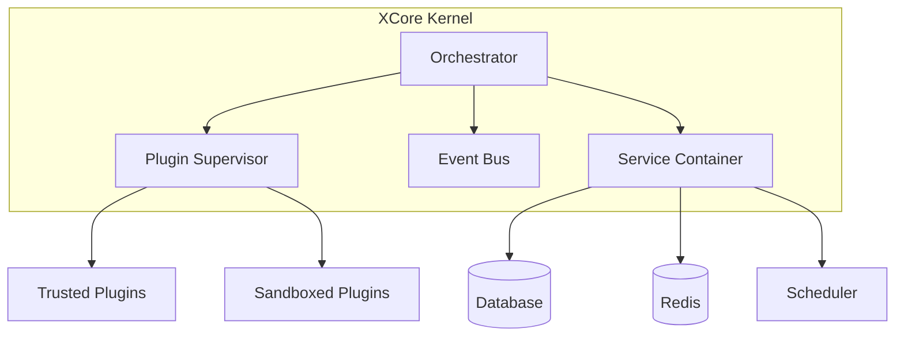

# ⚡ XCore Framework

[](https://github.com/traoreera/xcore)
[](LICENSE)
[](https://www.python.org/downloads/)
[](https://fastapi.tiangolo.com/)

**XCore** is a high-performance, plugin-first orchestration framework built on top of **FastAPI**. It is designed to load, isolate, and manage modular extensions (plugins) in a secure, sandboxed environment.

## 🏗️ Architecture Overview

XCore follows a "minimal core" philosophy where most features are provided via plugins or shared services.



---

## 🚀 Getting Started

### Prerequisites

- **Python 3.11+**
- **Poetry** (Package Manager)

### Installation

1. **Clone the repository**:
   ```bash
   git clone https://github.com/traoreera/xcore
   cd xcore
   ```

2. **Install dependencies**:
   ```bash
   poetry install
   ```

3. **Run the development server**:
   ```bash
   make run-dev
   ```

### Using pip or uv

```bash
pip install xcore
# or
uv add xcore
```

---

## 💻 Usage

### 1. Integration with FastAPI

```python
from fastapi import FastAPI
from xcore import Xcore
from contextlib import asynccontextmanager

xcore = Xcore(config_path="integration.yaml")

@asynccontextmanager
async def lifespan(app: FastAPI):
    await xcore.boot(app)
    yield
    await xcore.shutdown()

app = FastAPI(lifespan=lifespan)
```

### 2. Standalone Usage

```python
from xcore import Xcore
import asyncio

async def main():
    app = Xcore(config_path="integration.yaml")
    await app.boot()
    
    # Call a plugin action
    result = await app.plugins.call("users_plugin", "get_user", {"id": 1})
    print(result)
    
    await app.shutdown()

if __name__ == "__main__":
    asyncio.run(main())
```

---

## 🔌 Plugin Development

Plugins reside in the `plugins/` directory. A standard plugin structure looks like this:

```text
plugins/my_plugin/
├── plugin.yaml      # Manifest (metadata & entry point)
├── plugin.sig       # Security signature (for trusted plugins)
└── src/
    └── main.py      # Core logic
```

### Example `plugin.yaml`
```yaml
name: my_plugin
version: "2.0.0"
author: Your Name
description: "A sample plugin"
execution_mode: trusted  # or "sandboxed"
framework_version: ">=2.0"
entry_point: src/main.py

permissions:
  - resource: "cache.*"
    actions: ["read", "write"]
    effect: allow

resources:
  timeout_seconds: 30
  rate_limit:
    calls: 100
    period_seconds: 60
```

---

## 🛠️ CLI Reference

XCore comes with a powerful CLI for management and security.

| Command | Description |
| :--- | :--- |
| `xcore plugin list` | List all loaded plugins |
| `xcore plugin load <name>` | Load a specific plugin |
| `xcore plugin reload <name>` | Hot-reload a plugin |
| `xcore plugin sign <path>` | Generate a security signature for a plugin |
| `xcore plugin validate <path>`| Validate plugin manifest and structure |
| `xcore services status` | Check the health of DB, Cache, and Scheduler |
| `xcore health` | Perform a global system health check |

---

## 📜 Makefile Commands

| Command | Description |
| :--- | :--- |
| `make init` | Initialize project (install + run) |
| `make test` | Run the test suite |
| `make lint-fix` | Auto-format code (Black, Isort) |
| `make docker-dev` | Spin up development environment with Docker |
| `make logs-live` | View real-time structured logs |

---

## 📄 License

This project is licensed under the **MIT License**. See the [LICENSE](LICENSE) file for details.

---

<p align="center">
  Built with ❤️ by <b>Xcore team's</b>
</p>


<!-- Automated minor fix for issue #46 -->
